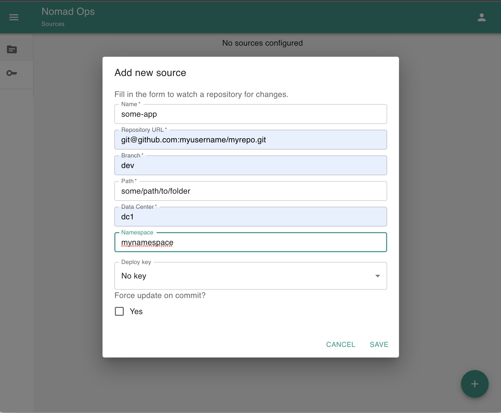
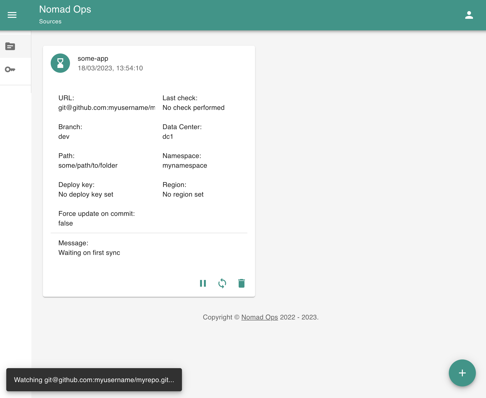

# Nomad Ops

This application brings [Gitops](TOdO) to the [nomad](https://www.nomadproject.io/) world. In short:

> Your manifests of what should be deployed live in one or multiple git-repositories and the application makes sure to synchronize your desired state with the nomad cluster.

> Source: https://codefresh.io

## UI

Nomad Ops comes with an integrated (simple) UI to onboard new repositories.

## Notifications

Nomad Ops is able to notify whenever the `current state` was changed.

The following notification channels are available.

### Slack

See [slack-config](./config/index.md#slack-notifier-settings)

### Webhook

See [webhook-config](./config/index.md#webhook-notifier-settings)