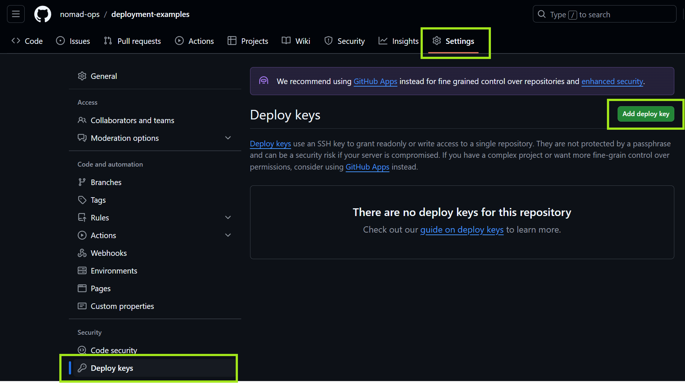
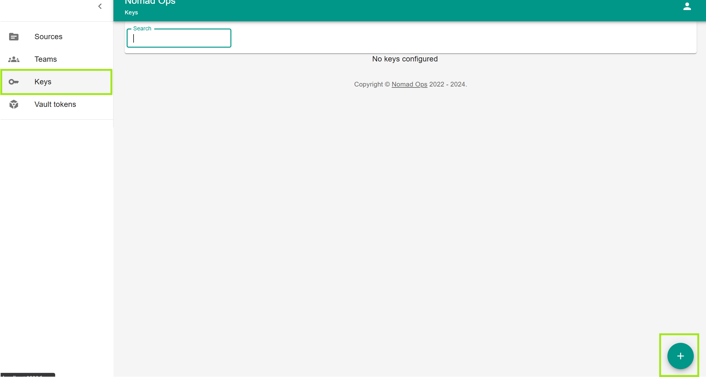
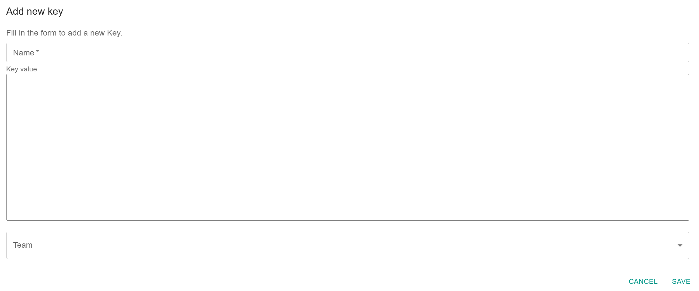
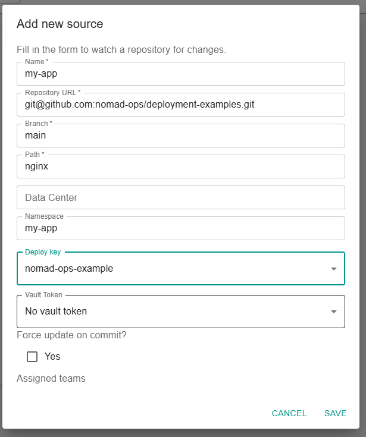

# Tutorials

## Deploy a simple webserver

This tutorial will guide you through the process of deploying a simple webserver to your nomad cluster.

### Prerequisites

- [Nomad](https://developer.hashicorp.com/nomad/docs/install) installed
- [Docker](https://docs.docker.com/get-docker/) installed
- Docker volumes enabled
- [Nomad-Ops set up](../Getting%20Started.md)

### Steps

1. Prepare access to your repository
2. Prepare the job file in your repository
3. Create a new source in Nomad-Ops
4. Watch the deployment

#### Prepare access to your repository

You need to have a repository where you can store your job files. This can be a public or private repository. Just make sure that you have access to the repository. Nomad-Ops requires read access to the repository. On private repositories, you need to provide a deploy key.

Follow the instructions of your git provider to register a deploy key. Below you find an example for GitHub.

##### Prepare a key pair

> Do not enter a passphrase

```bash
ssh-keygen -t ed25519 -C "your_email@example.com"
```

##### GitHub: Register the public key

Copy the public key.

> The public key is stored in `~/.ssh/id_ed25519.pub` if you did not change the default location.

1. Go to your repository in a webbrowser
2. Click on `Settings`
3. Click on `Deploy keys`
4. Click on `Add deploy key`



5. Enter a title for the key
6. Paste the public key into the key field

Switch to Nomad-Ops and create a new deploy key.

1. Click on `Keys`
2. Click on the floating `+` button in the bottom right corner
   


1. Enter a name for the key
2. Copy and paste the **private** key into the key field
   
> The **private** key is stored in `~/.ssh/id_ed25519` if you did not change the default location.



#### Prepare the job file in your repository

You need to create a job file in your repository. 

You can find examples at [https://github.com/nomad-ops/deployment-examples](https://github.com/nomad-ops/deployment-examples)

> It is not possible to use `file` functions in the job file. You need to provide the content directly.

#### Create a new source in Nomad-Ops

1. Click on `Sources`
2. Click on the floating `+` button in the bottom right corner
3. Fill in the form (see below for an example)



> The namespace has to be provisioned before you can create a source. You can do this by running `nomad namespace apply <namespace>`.

Once the source is created, you can pause the synchronization using the UI. You can also trigger a sync manually.

> The sync is triggered every minute by default. See [Configuration](../config/index.md) for more information.

